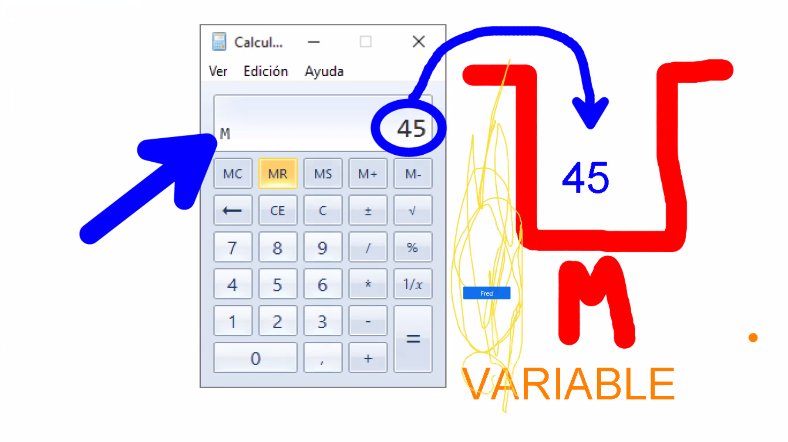
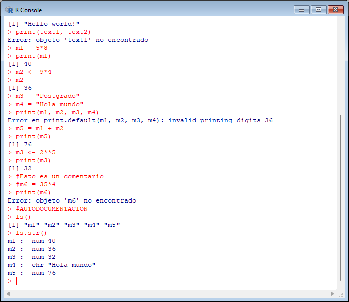
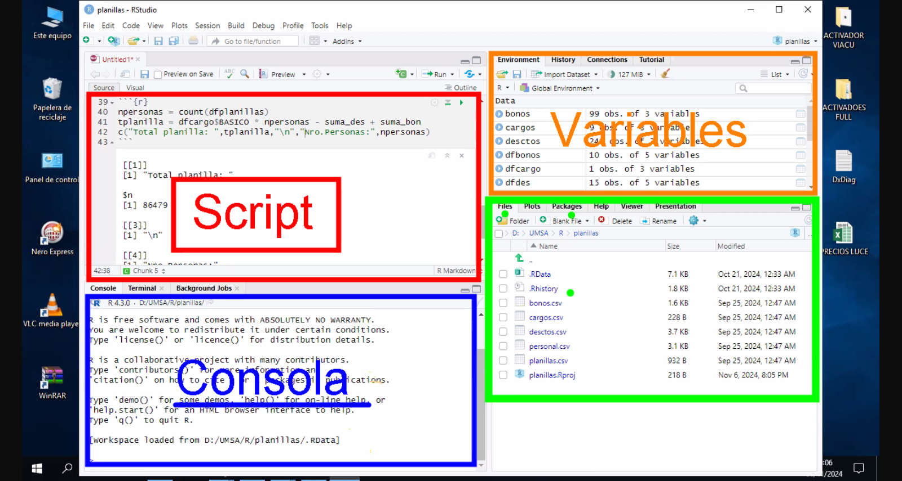

-   R es el software de análisis estadístico.

-   RStudio es el framework (herramientas para facilitar proyectos)

### Que es una variable?

Nos permite almacenar en “memoria” un valor, para recuperarlo posteriormente y poder usarlo en alguna operación.

{width="640"}

En el torno gráfico de R, probamos la asignación de algunas variables básicas.



## RStudio

Es una interfaz para R, que nos ayuda a gestionar de forma más sencilla distintos proyectos (directorios de trabajo).

-   Un proyecto es un conjunto de archivos (scripts), directorios, variables y paquetes, empleados para analizar datos.

-   Los proyectos pueden vincularse con un sistema de control de versiones (git o svn).

{width="640"}

------------------------------------------------------------------------

Desde aquí explicaremos el teorema de Pitágoras.

-   (control + alt + i) -\> nuevo chunk de R

-   (control + shift + enter) -\> ejecuta todo el chunk

-   (control + enter) -\> ejecuta la línea actual seleccionada en el chunk

```{r}
print("Teorema de Pitágoras")
# A continuacion probaremos el teorema de pitagoras
base <- 5
altura <- 4
hip <- base**2 + altura**2
res <- hip**0.5
print(paste("Resultado:", res))
```

Listar todas las variables activas:

```{r}
ls.str()
```

------------------------------------------------------------------------

## Tipos de datos

 [Este texto es rojo y grande usando etiquetas HTML]{style="color: red; font-size: 20px"}

```{r}
int <- 23
int2 <- as.integer(int)
float <- 19.84
complex <- 12+0i
text <- "Gerick"
#factor <- rojo
logic <- TRUE
nan <- NA
empty <- NULL
ls.str()

```

## Operaciones aritméticas

-   +suma

-   -resta

-   \*multiplicacion

-   / division

-   \*\* \^ potencia

-   %/% division entera

-   %% modulo

```{r}
2^3
2**3
25/6
25%/%6
15%%2
8%%2
```

## Operaciones de comparación

-   \< menor

-   \<= menor igual

-   \> mayor

-   \>= mayor igual

-   == igual que

-   != diferente de

```{r}

```

## Operadores Lógicos

-   AND &

-   OR \|

-   NOT !

```{r}

```

------------------------------------------------------------------------

## Estructuras de datos

```{r}
n = 22

if (n%%2 == 0){
  print("PAR")
}else{
  print("IMPAR")
}

print(ifelse(n %% 2 == 0, "PAR", "IMPAR"))

```

```{r}
npares <- 10
precio_par <- 450
ptotal <- npares * precio_par

if (npares == 2) {
  precio_final <- ptotal * 0.85  # 15% de descuento
} else if (npares >= 3) {
  precio_final <- ptotal * 0.75  # 25% de descuento
} else {
  precio_final <- ptotal  # Sin descuento
}

print(paste("Precio total:", precio_final))

```
